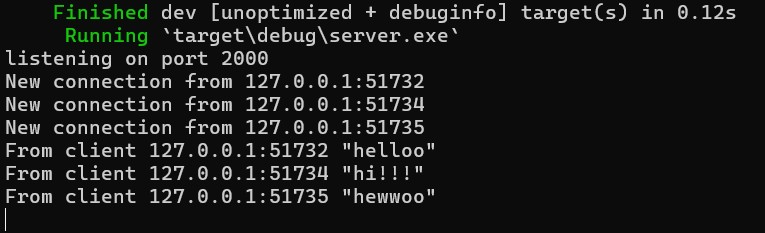
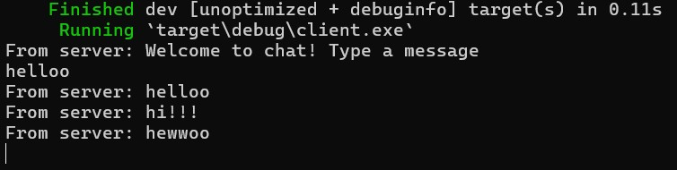
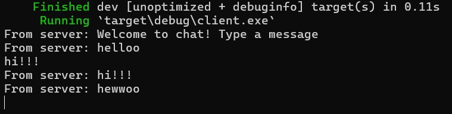
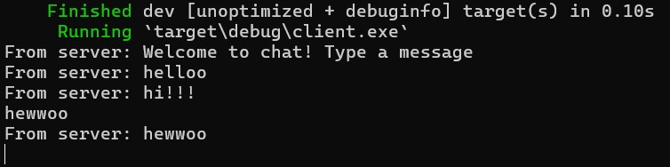
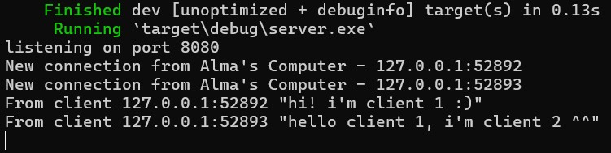
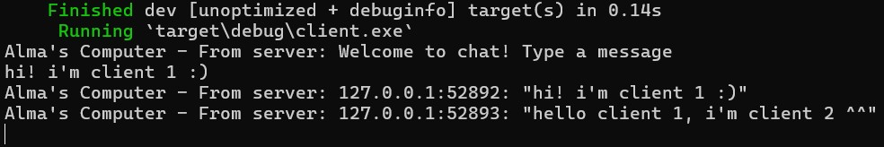
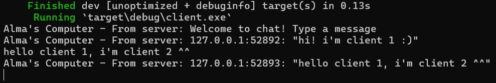

# 2.1. Original code of broadcast chat
Server:



Client 1:



Client 2:



Client 3:



After running the server with `cargo run --bin server` and running the three clients with `cargo run --bin client`, I noticed that when the clients are first instantiated, the server prints out "New connection from 127.0.0.1:5173X", indicating that another client has just connected to it. 

Every time I entered a message in the different clients, the server printed out the client address that sent each message & the message itself. Each client was also able to see its own message and other clients' messages reported back from the server, simulating a broadcast chat system.

<br>

# 2.2. Modifying the websocket port
To modify the port to be 8080, both the client.rs and the server.rs file needs to be changed. The changes are as follows:
- Client

```
async fn main() -> Result<(), tokio_websockets::Error> {
    let (mut ws_stream, _) =
        ClientBuilder::from_uri(Uri::from_static("ws://127.0.0.1:8080"))
            .connect()
            .await?;
    ...
}
```

- Server
```
async fn main() -> Result<(), Box<dyn Error + Send + Sync>> {
    let (bcast_tx, _) = channel(16);

    let listener = TcpListener::bind("127.0.0.1:8080").await?;
    println!("listening on port 8080");

    ...
}
```

After both these changes are made, the server and client will run successfully just like before, except now they're operating on port number 8080 instead of 2000. Both also seem to use the same websocket protocol.

<br>

# 2.3. Small changes. Add some information to client
Server:



Client 1:



Client 2:



In client.rs, I changed the code as follows:
```
    Some(Ok(msg)) => {
        if let Some(text) = msg.as_text() {
                println!("Alma's Computer - From server: {}", text);
            }
        },
...
```
This is done to add a prefix of "Alma's Computer" whenever a client receives a message from the server.

In server.rs, I changed the code as follows:
```
// Change what's broadcasted to clients

    if let Some(text) = msg.as_text() {
        println!("From client {addr:?} {text:?}");
        let sender_addr = format!("{addr:?}: {text:?}");
        bcast_tx.send(sender_addr.into())?;
    }
...

// Change what it prints out within the server itself

        let (socket, addr) = listener.accept().await?;
        println!("New connection from Alma's Computer - {addr:?}");
        let bcast_tx = bcast_tx.clone();
...
```
The first part was done so that every time the server broadcasts a message to clients, it'll also include the address of the client who originally sent that message. The second part was done so that every time a new connection occurred, it also included "Alma's Computer" in the prefix of the message.
